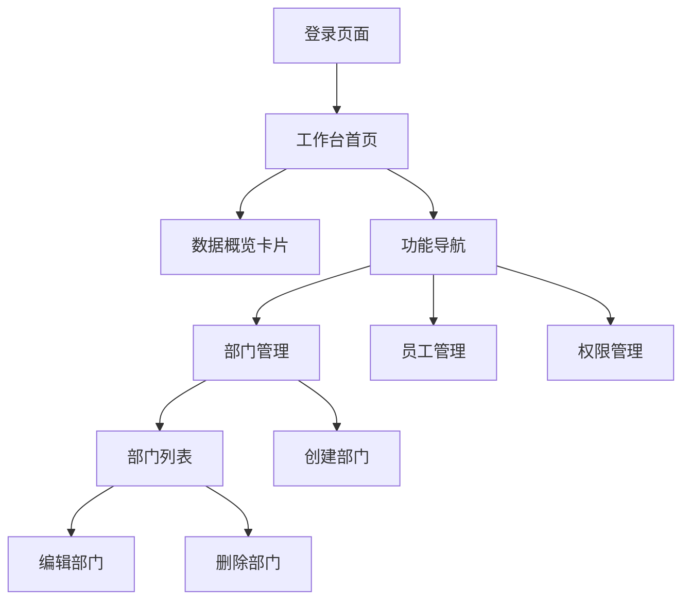

## 1. 产品概述
PitchLab企业管理后台是一个用于管理企业内部组织结构、员工信息和企业配置的综合管理平台。该系统帮助企业管理员高效管理部门、员工、权限等核心资源，支持演示环境和实际业务场景。

## 2. 核心功能

### 2.1 用户角色
| 角色 | 注册方式 | 核心权限 |
|------|----------|----------|
| 管理员 | 系统预设 | 完整的企业管理权限，包括部门管理、员工管理、权限配置等 |
| 演示用户 | 自动生成 | 查看演示数据，体验系统功能 |

### 2.2 功能模块
系统包含以下核心页面：
1. **工作台**：企业概览、数据统计、快捷操作入口
2. **部门管理**：部门创建、编辑、删除，部门员工统计
3. **员工管理**：员工信息维护、部门分配、权限设置
4. **系统设置**：企业信息配置、权限模板管理

### 2.3 页面详情
| 页面名称 | 模块名称 | 功能描述 |
|----------|----------|----------|
| 工作台 | 顶部导航栏 | 显示系统Logo、用户信息和通知 |
| 工作台 | 左侧菜单 | 主导航菜单，包含所有功能模块入口 |
| 工作台 | 数据概览卡片 | 显示部门总数、员工总数、创建时间等关键指标 |
| 工作台 | 功能导航 | 部门管理、员工管理、权限管理等子功能切换 |
| 部门管理 | 部门列表 | 表格展示所有部门信息，支持搜索和筛选 |
| 部门管理 | 部门操作 | 创建部门、编辑部门信息、删除部门 |
| 部门管理 | 状态显示 | 显示默认部门标识，区分系统预设部门 |

## 3. 核心流程

### 管理员操作流程
1. 登录系统后进入工作台首页
2. 查看企业数据统计概览
3. 点击左侧菜单进入具体功能模块
4. 在部门管理中创建和管理企业部门
5. 在员工管理中维护员工信息和部门分配

## 4. 用户界面设计

### 4.1 设计风格
- **主色调**：深黑色(#111-#222)用于主要文字，中灰色(#666-#888)用于次要文字
- **按钮样式**：主要操作按钮采用黑色背景配白色文字，圆角设计
- **字体**：无衬线UI字体，标题和数值使用粗体显示
- **布局风格**：卡片式布局，顶部导航+左侧菜单的经典后台布局
- **图标风格**：单色线性图标，简洁现代

### 4.2 页面设计概览
| 页面名称 | 模块名称 | UI元素 |
|----------|----------|----------|
| 工作台 | 顶部导航栏 | PitchLab Logo(黑色文字配图标)，用户头像和通知铃铛 |
| 工作台 | 左侧菜单 | 浅灰色背景，深色文字，小图标前置，当前选中项高亮显示 |
| 工作台 | 数据卡片 | 白色卡片配浅灰色边框和阴影，大字体显示数值，小图标装饰 |
| 工作台 | 功能导航 | 浅灰色文字标签，当前选中项深色文字配浅色背景 |
| 部门管理 | 部门表格 | 白色背景，灰色表头，操作列显示编辑和删除图标 |

### 4.3 响应式设计
采用桌面优先设计策略，确保在大屏幕上提供最佳用户体验。支持平板设备自适应，移动端采用简化布局。

### 4.4 交互设计
- 数据卡片：悬停时显示轻微阴影变化
- 表格行：悬停时背景色轻微变化
- 按钮：点击时有按压效果反馈
- 导航菜单：选中状态有明显的视觉区分