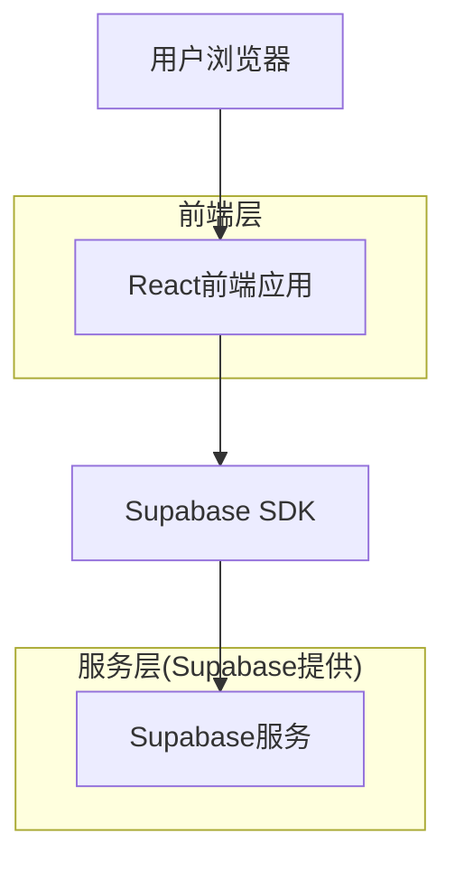
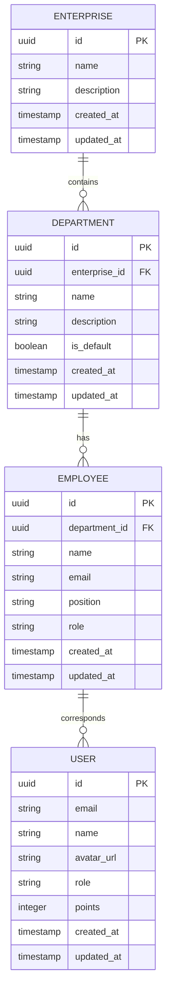

## 1. 架构设计



## 2. 技术栈描述

- **前端**: React@18 + TailwindCSS@3 + Vite
- **初始化工具**: vite-init
- **后端**: Supabase (BaaS)
- **数据库**: PostgreSQL (Supabase提供)
- **身份认证**: Supabase Auth

## 3. 路由定义

| 路由 | 用途 |
|------|------|
| / | 工作台首页，显示企业概览 |
| /departments | 部门管理页面，管理企业部门 |
| /employees | 员工管理页面，维护员工信息 |
| /permissions | 权限管理页面，配置系统权限 |
| /settings | 系统设置页面，企业信息配置 |

## 4. API定义

### 4.1 部门管理API

**获取部门列表**
```
GET /api/departments
```

响应参数:
| 参数名 | 参数类型 | 描述 |
|--------|----------|------|
| id | string | 部门唯一标识 |
| name | string | 部门名称 |
| description | string | 部门描述 |
| employee_count | number | 员工数量 |
| is_default | boolean | 是否为默认部门 |
| created_at | timestamp | 创建时间 |

**创建部门**
```
POST /api/departments
```

请求参数:
| 参数名 | 参数类型 | 是否必需 | 描述 |
|--------|----------|----------|------|
| name | string | 是 | 部门名称 |
| description | string | 否 | 部门描述 |

**更新部门**
```
PUT /api/departments/:id
```

**删除部门**
```
DELETE /api/departments/:id
```

### 4.2 员工管理API

**获取员工列表**
```
GET /api/employees
```

**获取企业统计信息**
```
GET /api/enterprise/stats
```

响应参数:
| 参数名 | 参数类型 | 描述 |
|--------|----------|------|
| department_count | number | 部门总数 |
| employee_count | number | 员工总数 |
| created_date | string | 企业创建日期 |

## 5. 数据模型

### 5.1 数据模型定义



### 5.2 数据定义语言

**企业表 (enterprises)**
```sql
-- 创建企业表
CREATE TABLE enterprises (
    id UUID PRIMARY KEY DEFAULT gen_random_uuid(),
    name VARCHAR(255) NOT NULL,
    description TEXT,
    created_at TIMESTAMP WITH TIME ZONE DEFAULT NOW(),
    updated_at TIMESTAMP WITH TIME ZONE DEFAULT NOW()
);

-- 创建索引
CREATE INDEX idx_enterprises_created_at ON enterprises(created_at DESC);
```

**部门表 (departments)**
```sql
-- 创建部门表
CREATE TABLE departments (
    id UUID PRIMARY KEY DEFAULT gen_random_uuid(),
    enterprise_id UUID REFERENCES enterprises(id) ON DELETE CASCADE,
    name VARCHAR(255) NOT NULL,
    description TEXT,
    is_default BOOLEAN DEFAULT FALSE,
    created_at TIMESTAMP WITH TIME ZONE DEFAULT NOW(),
    updated_at TIMESTAMP WITH TIME ZONE DEFAULT NOW()
);

-- 创建索引
CREATE INDEX idx_departments_enterprise_id ON departments(enterprise_id);
CREATE INDEX idx_departments_name ON departments(name);
```

**员工表 (employees)**
```sql
-- 创建员工表
CREATE TABLE employees (
    id UUID PRIMARY KEY DEFAULT gen_random_uuid(),
    department_id UUID REFERENCES departments(id) ON DELETE SET NULL,
    name VARCHAR(255) NOT NULL,
    email VARCHAR(255) UNIQUE NOT NULL,
    position VARCHAR(255),
    role VARCHAR(50) DEFAULT 'member',
    created_at TIMESTAMP WITH TIME ZONE DEFAULT NOW(),
    updated_at TIMESTAMP WITH TIME ZONE DEFAULT NOW()
);

-- 创建索引
CREATE INDEX idx_employees_department_id ON employees(department_id);
CREATE INDEX idx_employees_email ON employees(email);
```

**用户表 (users)**
```sql
-- 创建用户表
CREATE TABLE users (
    id UUID PRIMARY KEY DEFAULT gen_random_uuid(),
    email VARCHAR(255) UNIQUE NOT NULL,
    name VARCHAR(255) NOT NULL,
    avatar_url TEXT,
    role VARCHAR(50) DEFAULT 'user',
    points INTEGER DEFAULT 0,
    created_at TIMESTAMP WITH TIME ZONE DEFAULT NOW(),
    updated_at TIMESTAMP WITH TIME ZONE DEFAULT NOW()
);

-- 创建索引
CREATE INDEX idx_users_email ON users(email);
CREATE INDEX idx_users_role ON users(role);
```

### 5.3 权限配置

```sql
-- 基础权限配置
GRANT SELECT ON enterprises TO anon;
GRANT ALL PRIVILEGES ON enterprises TO authenticated;

GRANT SELECT ON departments TO anon;
GRANT ALL PRIVILEGES ON departments TO authenticated;

GRANT SELECT ON employees TO anon;
GRANT ALL PRIVILEGES ON employees TO authenticated;

GRANT SELECT ON users TO anon;
GRANT ALL PRIVILEGES ON users TO authenticated;

-- 行级安全策略
ALTER TABLE departments ENABLE ROW LEVEL SECURITY;
ALTER TABLE employees ENABLE ROW LEVEL SECURITY;
ALTER TABLE users ENABLE ROW LEVEL SECURITY;

-- 创建策略
CREATE POLICY "用户只能查看自己的数据" ON users FOR SELECT USING (auth.uid() = id);
CREATE POLICY "管理员可以管理所有数据" ON departments FOR ALL USING (auth.jwt() ->> 'role' = 'admin');
```

### 5.4 初始数据

```sql
-- 插入演示企业数据
INSERT INTO enterprises (name, description) VALUES 
('演示企业', '用于演示新版Pitchlab的功能，新用户默认点赞数1000');

-- 插入演示部门数据
INSERT INTO departments (enterprise_id, name, description, is_default) VALUES 
((SELECT id FROM enterprises LIMIT 1), '默认部门', '系统自动创建的默认部门', true),
((SELECT id FROM enterprises LIMIT 1), '开发部', '开发软件', false),
((SELECT id FROM enterprises LIMIT 1), '市场部', '市场部负责市场推广和品牌建设', false),
((SELECT id FROM enterprises LIMIT 1), '销售部', '销售部负责产品销售和客户关系', false);

-- 插入演示员工数据
INSERT INTO employees (department_id, name, email, position, role) VALUES 
((SELECT id FROM departments WHERE name = '默认部门' LIMIT 1), '张三', 'zhangsan@example.com', '产品经理', 'admin'),
((SELECT id FROM departments WHERE name = '默认部门' LIMIT 1), '李四', 'lisi@example.com', 'UI设计师', 'member'),
((SELECT id FROM departments WHERE name = '市场部' LIMIT 1), '王五', 'wangwu@example.com', '市场经理', 'manager'),
((SELECT id FROM departments WHERE name = '销售部' LIMIT 1), '赵六', 'zhaoliu@example.com', '销售代表', 'member');

-- 插入演示用户数据
INSERT INTO users (email, name, avatar_url, role, points) VALUES 
('dean@example.com', 'dean', 'https://example.com/avatar/yellow-cartoon.png', 'admin', 100);
```